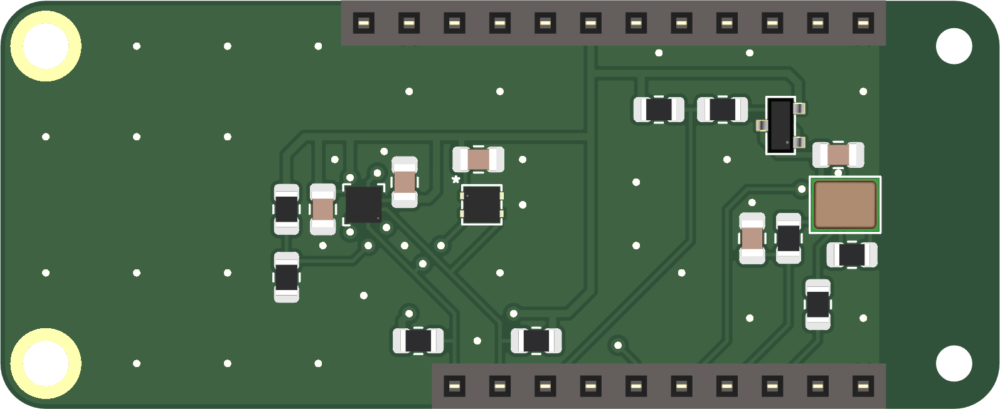

# Riotee Sensor Shield Hardware Design Files

The Riotee Sensor Shield adds a microphone, an accelerometer and a temperature and humidty sensor to the [Riotee Board](https://github.com/NessieCircuits/Riotee_Board).

## Sensors

The has the following sensors:
 - Bosch BMA400 digital accelerometer
 - Sensirion SHTC3 temperature and humidity sensor
 - Vesper VM1010 analog output microphone
